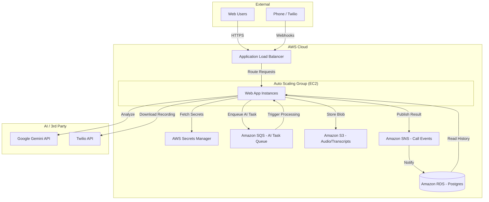

# AWS Target Architecture Diagram

This diagram illustrates the proposed high-scale architecture for deploying VoicePoC to AWS.

### Key Architectural Patterns for High Scale

1.  **Queue-Based Load Leveling**: By placing **SQS** between the webhook and the AI processing, we ensure that a sudden burst of calls doesn't overwhelm the AI service or our own compute resources. It also provides automatic retries.
2.  **Stateless Compute**: Moving data to **RDS** and **S3** allows the EC2 instances to be terminated and replaced at any time by the **Auto Scaling Group** without data loss.
3.  **Secrets Management**: **AWS Secrets Manager** removes the need for `appsettings.json` secrets, providing better rotation and auditability.
4.  **Pub/Sub (SNS)**: Decoupling the "completion" of a call from the "storage" in RDS allows for future extensions (e.g., sending an email, updating a dashboard) without modifying the core AI logic.
5.  **Database Scalability**: **RDS Postgres** supports read replicas, which can be used to scale out the "Get History" functionality if user traffic grows significantly.
